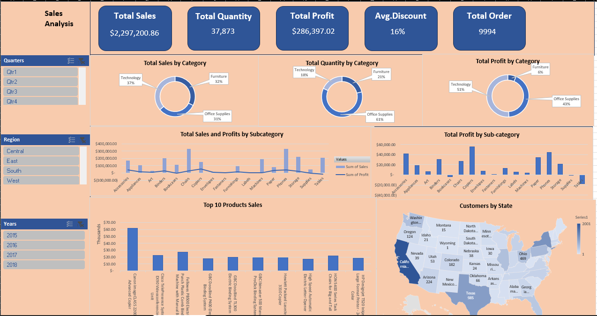

# 📊 Sales Analysis Dashboard  

  

## 📌 Overview  
This project provides an **interactive Sales Analysis Dashboard** built using Excel. The dashboard is designed to give a clear and insightful overview of sales performance across different categories, regions, quarters, and years.  

It helps businesses and analysts quickly identify trends, track performance, and make data-driven decisions.  

---

## 🚀 Features  
- **Key Metrics at a Glance**  
  - Total Sales: `$2,297,200.86`  
  - Total Quantity: `37,873`  
  - Total Profit: `$286,397.02`  
  - Average Discount: `16%`  
  - Total Orders: `9,994`  

- **Visual Insights**  
  - Sales, Quantity, and Profit by Category (Technology, Furniture, Office Supplies)  
  - Sales & Profit by Subcategory (Chairs, Phones, Binders, etc.)  
  - Top 10 Products by Sales  
  - Regional & State-wise Customer Distribution  

- **Filters for Dynamic Analysis**  
  - By Quarters (Q1–Q4)  
  - By Region (Central, East, South, West)  
  - By Years (2015–2018)  

---

## 📂 Files in Repository  
- `Dashboard.png` → Preview image of the Sales Dashboard  
- `Sales_Analysis_Dashboard.xlsx` → Excel file with the dashboard (if uploaded)  

---

## 🛠️ Tools & Technologies  
- **Microsoft Excel** (PivotTables, Charts, Slicers, Maps, and Formatting)  
- **Data Visualization Techniques** for business reporting  

---

## 📈 Insights from Dashboard  
1. **Technology** contributes the largest share of sales (37%) and profit (51%).  
2. **Office Supplies** dominates in quantity (61%).  
3. **Furniture** has the lowest profit margin despite a significant sales share (32%).  
4. Certain subcategories (like Tables) are generating losses.  
5. **California** has the highest customer base, followed by Texas, New York, and Ohio.  

---

## 💡 Use Cases  
- Business managers tracking regional sales performance.  
- Analysts identifying profitable products & categories.  
- Teams monitoring sales growth trends over multiple years.  

---

## 📜 License  
This project is released under the **MIT License** – free to use and modify.  
